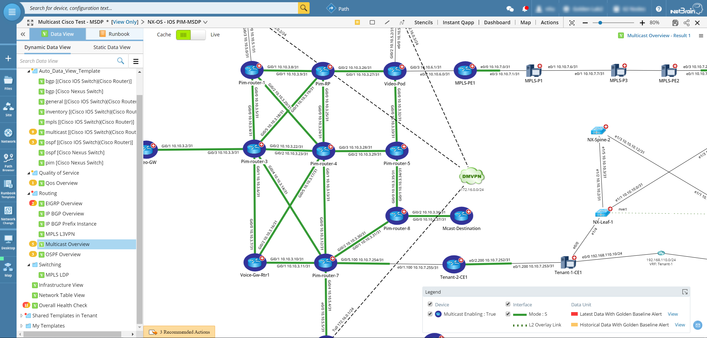
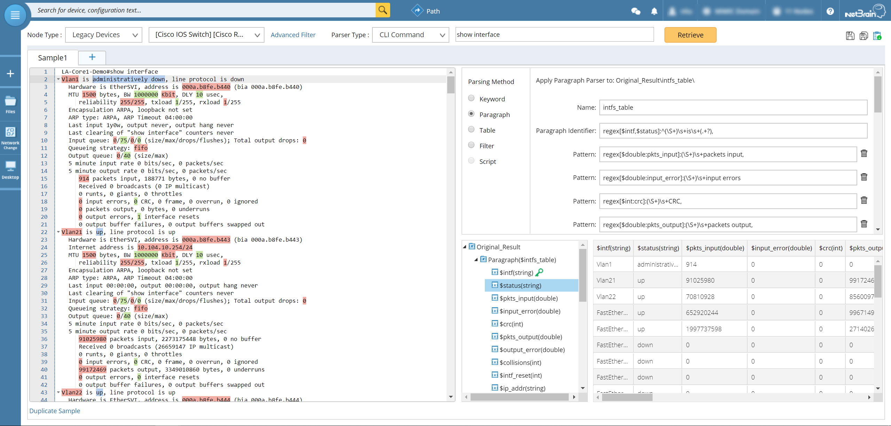
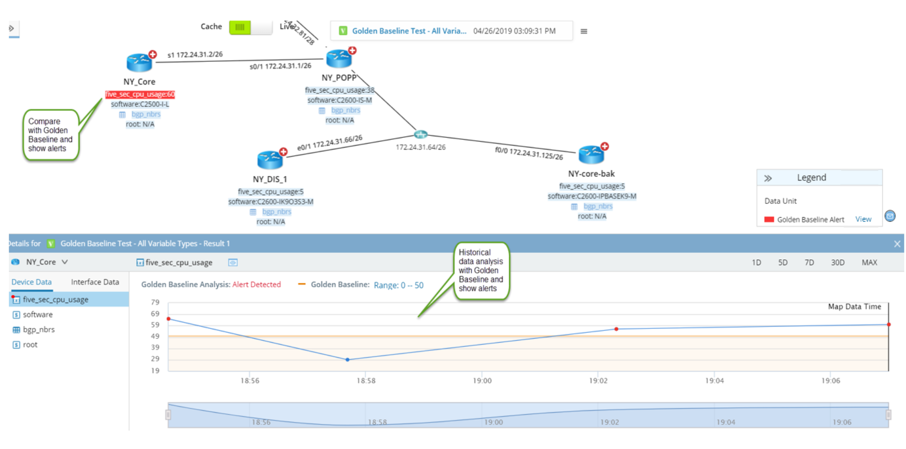

# Automation_Package
NetBrain Automation Package Resource List
Version: 05/12/2020

## Resource includes:

### [Data View Template](https://www.netbraintech.com/docs/ie80/help/index.html?data-view.htm)
Decode Your Network 

**(Total Number: 126)**

### [Runbook Template](https://www.netbraintech.com/docs/ie80/help/index.html?using-runbook.htm)
Digitalize Your Procedure

**(Total Number: 118)**

### [Parser](https://www.netbraintech.com/docs/ie80/help/index.html?parser-library.htm)
Automate Your Commands

**(Total Number: 1407)**

### [Golden Baseline](https://www.netbraintech.com/docs/ie80/help/index.html?golden-baseline.htm)
Baseline Your Variables

**(Total Number: 360)**

## Resource category by network vendor or OS:
* [Alcatel Lucent Service Router](vendor_list/alcatel_lucent_service_router.md)
* [Arista Switch](vendor_list/arista_switch.md)
* [Checkpoint Firewall](vendor_list/checkpoint_firewall.md)
* [Cisco IOS](vendor_list/cisco_ios.md)
* [Cisco IOS XR](vendor_list/cisco_ios_xr.md)
* [Cisco Nexus (NXOS)](vendor_list/cisco_nexus_nxos.md)
* [Cisco ASA Firewall](vendor_list/cisco_asa_firewall.md)
* [F5 Load Balancer](vendor_list/f5_load_balancer.md)
* [Fortigate Firewall](vendor_list/fortigate_firewall.md)
* [Juniper (JUNOS)](vendor_list/juniper_junos.md)
* [Palo Alto Firewall](vendor_list/palo_alto_firewall.md)