# Content Type: DVT
## NetBrain Path: Auto_Data_View_Template\ospf [(Cisco IOS Switch)(Cisco Router)]

## Map View

  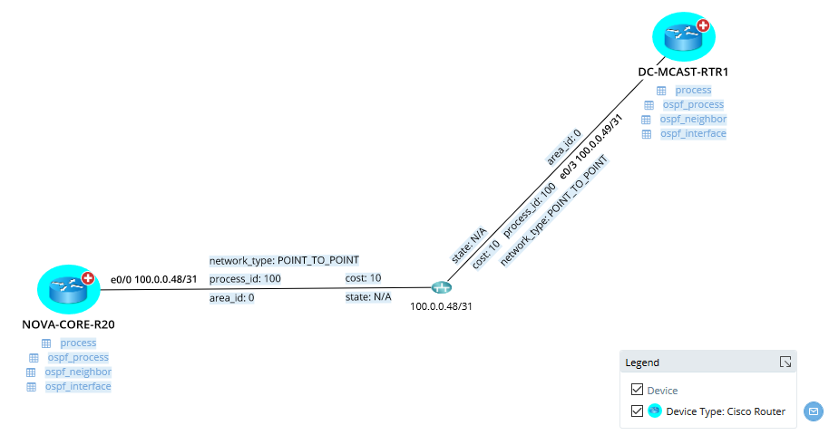

## Device Data Unit 1 - Router ID

  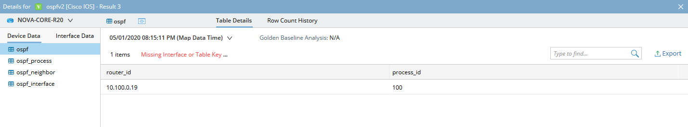

## Device Data Unit 2 - OSPF Process

  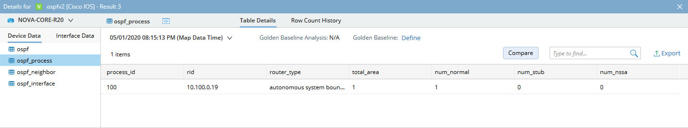

## Device Data Unit 3 - OSPF Neighbors

  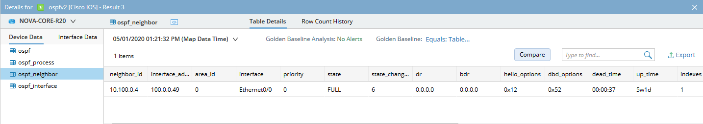

## Device Data Unit 4 - OSPF Interfaces

  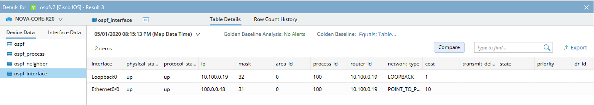

## Device Data Unit 4 - OSPF Interface Comparison

  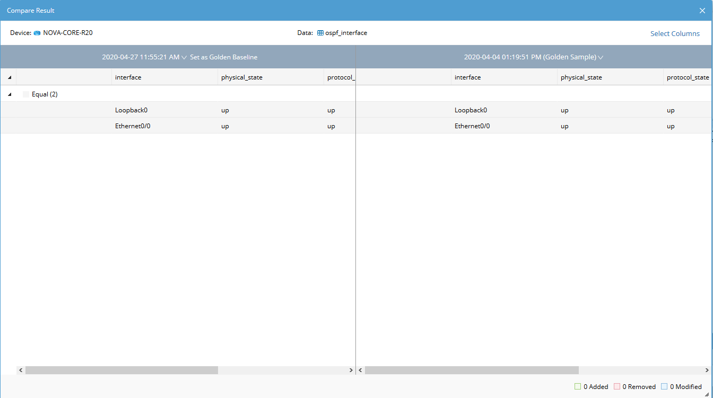

## Interface Data Unit 1 - OSPF Process ID

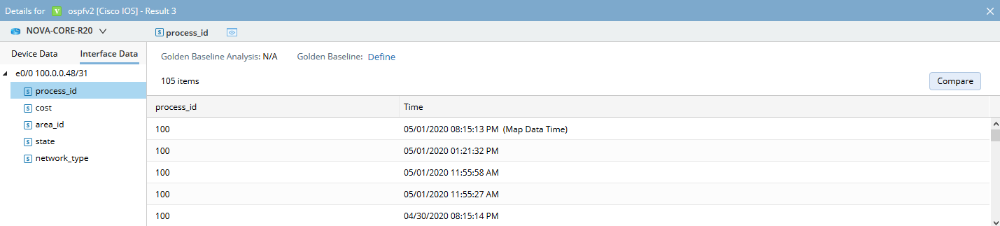

## Interface Data Unit 2 - Interface Cost

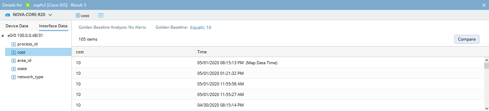

## Interface Data Unit 3 - Interface Area ID

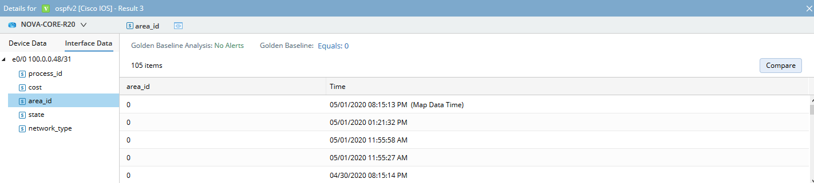

## Interface Data Unit 4 - Interface State

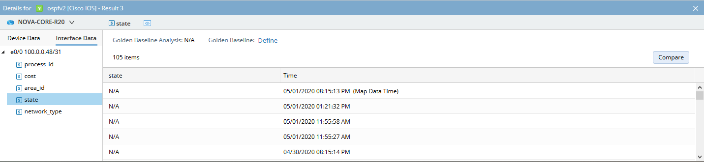

## Interface Data Unit 5 - Interface Network Type

  

# Content Type: Runbook
## Auto_Runbook_Template\ospf [(Cisco IOS Switch)(Cisco Router)]

 

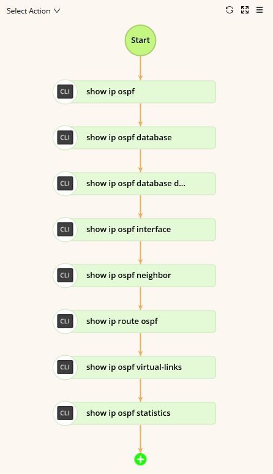

[//]: # (This syntax works like a comment, and won't appear in any output.)

<!--

http://192.168.29.94/map.html?t=8b26ed3e-4c8c-45ac-677d-9485779ca2b3&d=3da25e68-c5bb-4425-9d8c-3eac1e53b6e0&id=8e669745-b4dd-6cdb-4ca1-8ef68b535e4c&rba=2b7287fe-4c0d-a74b-efac-e4d642e42418

-->
